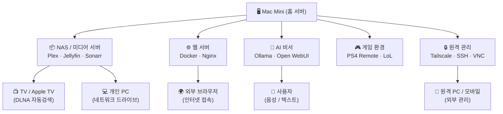

# 🖥️ Mac Mini 홈 서버 구축 계획서

> 작성일: 2026-06-07  
> 목적: Mac Mini를 활용한 개인 서버 환경 구축 로드맵

---

## 전체 아키텍처 개요




---

## 1. NAS / 미디어 서버

### 목적

- 외장 드라이브 또는 내장 저장소를 NAS처럼 활용
- TV 및 개인 PC에서 미디어 자동 검색 및 스트리밍
- 시놀로지 NAS 수준의 기능을 소프트웨어로 구현

### 미디어 폴더 구조

```
📁 미디어 저장소 (외장 HDD / NAS 마운트)
├── 📁 TV_공유/               ← TV에서 재생 (가족 공용)
│   ├── 📁 영화/
│   ├── 📁 드라마/
│   └── 📁 애니메이션/
└── 📁 개인_비공개/           ← 개인 전용 (별도 접근 권한)
    ├── 📁 영화/
    └── 📁 기타/
```

### 필요 소프트웨어 스택


| 역할     | 소프트웨어                              | 설명                     |
| ------ | ---------------------------------- | ---------------------- |
| 미디어 서버 | **Plex** 또는 **Jellyfin**           | TV/PC 자동 검색, 스트리밍      |
| 토렌트 관리 | **qBittorrent** / **Transmission** | 자동 다운로드                |
| 자동 분류  | **Sonarr** (드라마) / **Radarr** (영화) | 메타데이터 기반 자동 정리         |
| 인덱서    | **Prowlarr**                       | 토렌트 인덱서 통합 관리          |
| 파일 공유  | **SMB / AFP** (macOS 내장)           | PC/TV에서 네트워크 드라이브 마운트  |
| DLNA   | Plex / Jellyfin 내장                 | TV 자동 검색 (삼성/LG TV 호환) |


### 구현 흐름

```
토렌트 사이트
     │
     ▼
Prowlarr (인덱서 관리)
     │
     ├──▶ Sonarr (드라마 자동 관리) ──▶ qBittorrent ──▶ 📁 TV_공유/드라마/
     │
     └──▶ Radarr (영화 자동 관리)  ──▶ qBittorrent ──▶ 📁 TV_공유/영화/
                                                              │
                                                              ▼
                                                    Plex / Jellyfin
                                                    (메타데이터 자동 수집)
                                                              │
                                          ┌───────────────────┤
                                          ▼                   ▼
                                    Apple TV / TV         PC 브라우저
                                    (DLNA 자동검색)        (웹 UI)
```

### 체크리스트

- 외장 HDD 또는 내부 스토리지 확보 (최소 2TB 권장)
- 외장 드라이브 볼륨 이름 고정 (디스크 유틸리티 → 볼륨 이름 지정: `SSD1`, `SSD2`)
- 재부팅 후 자동 마운트 확인 (시스템 설정 → 일반 → 로그인 항목에서 드라이브 추가)
- Homebrew 설치
- Docker Desktop (Mac) 설치
- Plex 또는 Jellyfin 설치 및 설정
- TV_공유 / 개인_비공개 폴더 권한 분리 설정
- DLNA 활성화 및 TV 연결 테스트
- Sonarr + Radarr + Prowlarr 연동
- **Jellyfin 하드웨어 가속 활성화** (필수 — 미설정 시 4K 재생 시 CPU 폭주)
  - Jellyfin 관리 → 대시보드 → 재생 → 트랜스코딩
  - **하드웨어 가속**: `Video Toolbox` 선택 (Apple Silicon 전용)
  - H.264 / HEVC / AV1 하드웨어 디코딩 체크 활성화

---

## 2. 웹 서버 (Docker 기반)

### 목적

- 24시간 상시 운영 웹 서버
- Cursor에서 개발한 프로젝트를 Docker 컨테이너로 배포
- 각 서비스 독립 운영 (포트 분리)
- 공유기 포트 오픈 없이 외부에서 안전하게 접속

---

### macOS 호스트 vs Docker 내부 구분

```
┌─────────────────────────────────────────────────────────────┐
│  macOS 호스트 (설치 위치)                                    │
│                                                             │
│  /usr/local/bin/cloudflared   ← Homebrew로 설치, 항상 실행  │
│  ollama                       ← Homebrew로 설치 (GPU 가속)  │
│  ~/actions-runner-app1/       ← GitHub Runner (앱별 폴더)   │
│  ~/actions-runner-app2/                                     │
│  ~/docker/                    ← 모든 Docker 설정 모음        │
│  /Volumes/SSD1/               ← 외장 SSD 1 (미디어)         │
│  /Volumes/SSD2/               ← 외장 SSD 2 (데이터/백업)    │
│                                                             │
│  ┌─────────────────────────────────────────────────────┐   │
│  │  Docker (OrbStack)                                  │   │
│  │                                                     │   │
│  │  npm (Nginx Proxy Manager)  ← Docker 컨테이너       │   │
│  │  portainer                  ← Docker 컨테이너       │   │
│  │  uptime-kuma                ← Docker 컨테이너       │   │
│  │  jellyfin                   ← Docker 컨테이너       │   │
│  │  open-webui                 ← Docker 컨테이너       │   │
│  │  (Ollama는 호스트 직접 설치, GPU 가속 필요)         │   │
│  │  앱1, 앱2, 앱3 ...          ← Docker 컨테이너       │   │
│  └─────────────────────────────────────────────────────┘   │
└─────────────────────────────────────────────────────────────┘
```

---

### 맥미니 폴더 구조 설계

```
~/ (홈 디렉토리 /Users/유저명/)
│
├── docker/                          ← 모든 Docker 관련 파일
│   │
│   ├── infra/                       ← 공통 인프라 (항상 실행)
│   │   ├── docker-compose.yml       ← NPM + Portainer + Uptime Kuma
│   │   ├── npm/
│   │   │   ├── data/                ← NPM 설정 데이터
│   │   │   └── letsencrypt/         ← SSL 인증서
│   │   └── portainer/
│   │       └── data/
│   │
│   ├── media/                       ← 미디어 서버
│   │   ├── docker-compose.yml       ← Jellyfin + Sonarr + Radarr
│   │   └── config/
│   │       ├── jellyfin/
│   │       ├── sonarr/
│   │       └── radarr/
│   │
│   ├── ai/                          ← AI 비서 (Open WebUI만 Docker)
│   │   └── docker-compose.yml       ← Open WebUI (Ollama는 macOS 호스트 직접 설치)
│   │
│   ├── app1/                        ← 앱 서비스 1 (앱 이름으로 교체)
│   │   ├── docker-compose.yml
│   │   └── .env                     ← 환경변수 (Git 제외)
│   │
│   ├── app2/                        ← 앱 서비스 2
│   │   ├── docker-compose.yml
│   │   └── .env
│   │
│   ├── db/                          ← 공용 데이터베이스
│   │   ├── docker-compose.yml       ← PostgreSQL + Redis
│   │   └── data/                    ← DB 데이터 (내장 SSD에 저장)
│   │       ├── postgres/
│   │       └── redis/
│   │
│   └── monitoring/                  ← 모니터링 (선택)
│       └── docker-compose.yml       ← Netdata
│
├── actions-runner-app1/             ← GitHub Runner (저장소 A)
├── actions-runner-app2/             ← GitHub Runner (저장소 B)
├── actions-runner-app3/             ← GitHub Runner (저장소 C)
│
└── .cloudflared/                    ← Cloudflare Tunnel 설정
    ├── config.yml
    └── <터널ID>.json

/Volumes/
├── SSD1/                            ← 외장 SSD 1 (미디어 전용)
│   ├── TV_공유/
│   │   ├── 영화/
│   │   ├── 드라마/
│   │   └── 애니메이션/
│   └── 개인_비공개/
│       └── 영화/
│
└── SSD2/                            ← 외장 SSD 2 (백업 전용 — 평소 분리 가능)
    ├── db_backup/                   ← DB 덤프 백업
    ├── docker_backup/               ← Docker 설정 백업
    └── files/                       ← 기타 파일
```

---

### 도메인 구조 (내도메인.org 기준)

> ✅ Cloudflare 계정 및 도메인 보유 완료

```
내도메인.org                  →  메인 웹사이트
www.내도메인.org              →  메인 웹사이트 (동일)
│
├── 맥미니 인프라 서비스 (외부 공개)
│   ├── nas.내도메인.org      →  Jellyfin      :8096  (미디어 스트리밍)
│   ├── ai.내도메인.org       →  Open WebUI    :3000  (AI 비서)
│   └── monitor.내도메인.org  →  Uptime Kuma   :3001  (서비스 모니터링)
│
├── 관리 서비스 (⚠️ 외부 미노출 → Tailscale VPN 전용)
│   ├── 맥미니-tailscale-IP:9000  →  Portainer     (Docker 관리)
│   └── 맥미니-tailscale-IP:81    →  NPM 관리 UI   (프록시 관리)
│
└── 앱 서비스 (앱 이름 확정 후 업데이트)
    ├── [앱1].내도메인.org    →  Docker 앱 1   :3001
    ├── [앱2].내도메인.org    →  Docker 앱 2   :3002
    └── api.내도메인.org      →  API 서버      :4001
```

### 외부 접속 전체 구조

```
외부 사용자 (브라우저 / 아이폰)
        │
        │ https://nas.내도메인.org 등
        ▼
  Cloudflare (DNS + CDN + DDoS 방어 + SSL 자동)
        │
        │ Cloudflare Tunnel (공유기 포트 오픈 불필요)
        ▼
    맥 미니 (집)
        │
        │ 모든 트래픽을 NPM(:80)으로 단일 진입
        ▼
  Nginx Proxy Manager (Host 헤더 기반 내부 라우팅)
        │
        ├──▶ nas.내도메인.org     →  Jellyfin    :8096
        ├──▶ ai.내도메인.org      →  Open WebUI  :3000
        ├──▶ monitor.내도메인.org →  Uptime Kuma :3001 (컨테이너 내부)
        ├──▶ [앱1].내도메인.org   →  Docker 앱1  :3001
        ├──▶ [앱2].내도메인.org   →  Docker 앱2  :3002
        └──▶ api.내도메인.org     →  API 서버    :4001

※ Portainer(:9000) · NPM 관리UI(:81)는 외부 미노출 → Tailscale VPN 접속 후 내부 IP로만 접근
```

### Cloudflare Access (추가 인증 레이어)

외부에 공개된 서비스에 **Google 로그인 / OTP** 등 추가 인증을 덧씌울 수 있습니다.  
Cloudflare 계정이 있으면 무료로 사용 가능하며, VPN 없이 안전하게 관리 서비스에 접근할 수 있습니다.

```
외부 사용자
    │
    ▼
Cloudflare Access (Google 로그인 / OTP 인증)
    │  인증 통과 후에만
    ▼
Cloudflare Tunnel → NPM → 서비스
```

**설정 방법** (Cloudflare Zero Trust 대시보드)

1. [one.dash.cloudflare.com](https://one.dash.cloudflare.com) → Access → Applications → Add an Application
2. **Self-hosted** 선택
3. 보호할 도메인 입력 (예: `ai.내도메인.org`, `monitor.내도메인.org`)
4. Policy 설정 → Emails 또는 Google 계정으로 허용 범위 지정

**우선 적용 권장 대상**

| 서비스 | 이유 |
| --- | --- |
| `ai.내도메인.org` | AI 비서 — 외부 노출 시 무단 사용 가능 |
| `monitor.내도메인.org` | 서버 상태 정보 노출 위험 |
| `[앱].내도메인.org` | 개발 중인 서비스 조기 접근 차단 |

> Portainer · NPM 관리 UI는 Cloudflare Access가 아닌 **Tailscale VPN 전용**으로 유지

---

### Cloudflare Tunnel vs 포트포워딩


| 방식                    | 공유기 설정 | 보안       | 난이도 | 추천      |
| --------------------- | ------ | -------- | --- | ------- |
| **Cloudflare Tunnel** | 불필요    | IP 완전 숨김 | ★☆☆ | ✅ 강력 추천 |
| 포트포워딩 + DNS           | 필요     | IP 노출    | ★★☆ | △       |


### Docker 서비스 구성도

```
Mac Mini (24h 상시 가동)
│
├── cloudflared (Tunnel 데몬, 아웃바운드 연결 유지)
│
└── Docker Engine
    │
    ├── 🌐 Nginx Proxy Manager  :80 / :443 (내부 라우팅)
    │       │
    │       ├──▶ 서비스 A (Todo 앱)     :3001
    │       ├──▶ 서비스 B (개인 블로그) :3002
    │       ├──▶ 서비스 C (API 서버)    :4001
    │       └──▶ Jellyfin (미디어)      :8096
    │
    ├── 🗄️ PostgreSQL / MariaDB        :5432
    ├── 🔴 Redis (캐시)                :6379
    ├── 📊 Portainer (Docker 관리 UI)  :9000
    └── 📈 Uptime Kuma (모니터링)      :3100
```

### 로컬 개발 → 배포 전체 흐름

```
Cursor IDE (맥북 or 맥미니)
      │
      │ 로컬 테스트: localhost:3001 직접 접속
      │
      │ git push origin main
      ▼
GitHub 저장소
      │
      │ GitHub Actions 트리거
      ▼
맥미니 Self-hosted Runner
      │
      │ git pull + docker compose up -d --build
      ▼
Docker 컨테이너 재시작
      │
      ▼
Cloudflare Tunnel → 외부 자동 반영
```

### Cloudflare Tunnel 설정 방법

```bash
# 1. cloudflared 설치
brew install cloudflare/cloudflare/cloudflared

# 2. 기존 Cloudflare 계정으로 로그인 (브라우저 자동 열림)
cloudflared tunnel login

# 3. 터널 생성
cloudflared tunnel create macmini

# 4. DNS 라우팅 등록 (서비스별 반복)
cloudflared tunnel route dns macmini nas.내도메인.org
cloudflared tunnel route dns macmini ai.내도메인.org
cloudflared tunnel route dns macmini monitor.내도메인.org
cloudflared tunnel route dns macmini docker.내도메인.org
cloudflared tunnel route dns macmini api.내도메인.org

# 5. 맥미니 재부팅 후 자동 시작 등록
cloudflared service install
```

**config.yml 템플릿** (`~/.cloudflared/config.yml`)

> Cloudflare Tunnel은 모든 트래픽을 NPM(:80)으로 보내고,  
> NPM이 Host 헤더를 기준으로 각 Docker 서비스에 라우팅합니다.  
> Portainer·NPM 관리 UI는 외부에 노출하지 않고 Tailscale VPN 전용으로 운영합니다.

```yaml
tunnel: <맥미니-터널-ID>
credentials-file: /Users/유저명/.cloudflared/<터널ID>.json

ingress:
  # 외부 공개 서비스 → 모두 NPM(:80)으로 단일 진입
  - hostname: nas.내도메인.org
    service: http://localhost:80

  - hostname: ai.내도메인.org
    service: http://localhost:80

  - hostname: monitor.내도메인.org
    service: http://localhost:80

  - hostname: api.내도메인.org
    service: http://localhost:80

  # 앱 서비스 (앱 이름 확정 후 추가)
  # - hostname: [앱1].내도메인.org
  #   service: http://localhost:80
  # - hostname: [앱2].내도메인.org
  #   service: http://localhost:80

  # ⚠️ Portainer(docker.내도메인.org)는 외부 노출 금지
  # → Tailscale 접속 후 http://맥미니-tailscale-IP:9000 으로 직접 접근

  # 매칭 안 되는 요청 처리 (필수, 마지막에 위치)
  - service: http_status:404
```

### 필요 소프트웨어 스택


| 역할         | 소프트웨어                              | 설명                                  |
| ---------- | ---------------------------------- | ----------------------------------- |
| 컨테이너 런타임   | **OrbStack** (추천) / Docker Desktop | Mac에서 Docker 실행, OrbStack이 더 가볍고 빠름 |
| 외부 터널      | **Cloudflare Tunnel**              | 포트 오픈 없이 외부 접속, 무료                  |
| 리버스 프록시    | **Nginx Proxy Manager**            | 도메인별 내부 라우팅, 웹 UI 제공                |
| SSL 인증서    | Cloudflare 자동 처리                   | HTTPS 별도 설정 불필요                     |
| 컨테이너 관리 UI | **Portainer**                      | 웹 UI로 Docker 관리                     |
| DB         | **PostgreSQL** / **MariaDB**       | 앱별 데이터베이스                           |
| 모니터링       | **Uptime Kuma**                    | 서비스 상태 24h 모니터링                     |


### Nginx Proxy Manager (NPM) 설치 및 설정

Cloudflare Tunnel이 외부 → 맥미니로 트래픽을 전달하면,  
NPM이 내부에서 서브도메인별로 각 Docker 컨테이너에 라우팅합니다.

#### 사전 준비 — Docker 공용 네트워크 생성

각 서비스가 별도의 `docker-compose.yml`로 분리되어 있으면 기본적으로 서로 다른 네트워크에 격리됩니다. NPM이 컨테이너 이름으로 각 서비스를 찾으려면 **모든 컨테이너를 하나의 공용 네트워크에 참여**시켜야 합니다.

```bash
# 최초 1회만 실행 (맥미니 세팅 시점에 생성)
docker network create proxy-net
```

이후 모든 `docker-compose.yml`에 아래 블록을 추가하면 NPM이 컨테이너 이름으로 직접 통신할 수 있습니다.

```yaml
# 각 docker-compose.yml 하단에 공통으로 추가
networks:
  proxy-net:
    external: true  # 위에서 생성한 공용 네트워크 참조
```

그리고 각 서비스에 `networks: [proxy-net]` 를 지정합니다.

```yaml
services:
  my-app:
    image: ...
    networks:
      - proxy-net   # ← 이 한 줄로 NPM과 같은 네트워크에 조인

networks:
  proxy-net:
    external: true
```

> 이렇게 하면 NPM의 Forward Hostname을 `localhost` 대신 **컨테이너 이름**으로 통일할 수 있어 훨씬 명확하고 오류가 없습니다.

#### 설치 (docker-compose.yml)

```yaml
# ~/docker/infra/docker-compose.yml (NPM 단독 파일)

services:
  npm:
    image: jc21/nginx-proxy-manager:latest
    container_name: nginx-proxy-manager
    restart: always
    ports:
      - "80:80"       # HTTP
      - "443:443"     # HTTPS
      - "81:81"       # NPM 관리 웹 UI (Tailscale 전용)
    volumes:
      - ./data:/data
      - ./letsencrypt:/etc/letsencrypt
    networks:
      - proxy-net

networks:
  proxy-net:
    external: true
```

```bash
# 실행
cd ~/docker/infra
docker compose up -d

# 관리 UI 접속 (초기 설정)
# http://localhost:81
# 초기 계정: admin@example.com / changeme
# → 최초 로그인 후 이메일/비밀번호 즉시 변경
```

---

#### NPM 프록시 호스트 설정 (웹 UI에서 등록)

관리 UI(`localhost:81`) → **Proxy Hosts → Add Proxy Host**


| 도메인                | Forward Hostname | Forward Port | 비고          |
| ------------------ | ---------------- | ------------ | ----------- |
| `nas.내도메인.org`     | `jellyfin`       | `8096`       | 컨테이너 이름 (proxy-net 동일 네트워크) |
| `ai.내도메인.org`      | `open-webui`     | `3000`       | 컨테이너 이름 (proxy-net 동일 네트워크) |
| `monitor.내도메인.org` | `uptime-kuma`    | `3001`       | 컨테이너 내부 포트 기준 |
| `api.내도메인.org`     | `app-api`        | `4001`       | 컨테이너 이름으로 통일 권장 |
| `[앱1].내도메인.org`    | `app1`           | `3001`       | 컨테이너 이름으로 통일 권장 |
| `[앱2].내도메인.org`    | `app2`           | `3002`       | 컨테이너 이름으로 통일 권장 |

> 💡 모든 서비스가 `proxy-net`에 조인되어 있으면 Forward Hostname을 컨테이너 이름으로 통일할 수 있습니다.  
> 서비스를 별도 `docker-compose.yml`로 분리 실행하더라도 `networks: proxy-net: external: true` 선언만 추가하면 NPM이 컨테이너를 찾을 수 있습니다.

> ⚠️ **Portainer(:9000) · NPM 관리 UI(:81)는 프록시 호스트 등록 금지**  
> → Tailscale VPN 접속 후 내부 IP(`http://맥미니-tailscale-IP:9000`)로만 접근

> Cloudflare Tunnel이 SSL을 처리하므로 NPM에서 SSL 설정은 불필요

---

#### NPM Advanced 설정 (Websocket 사용 앱)

Open WebUI, Portainer 등 WebSocket을 사용하는 앱은 Advanced 탭에 추가:

```nginx
proxy_set_header Upgrade $http_upgrade;
proxy_set_header Connection "upgrade";
proxy_set_header Host $host;
proxy_set_header X-Real-IP $remote_addr;
proxy_set_header X-Forwarded-For $proxy_add_x_forwarded_for;
proxy_set_header X-Forwarded-Proto $scheme;
```

---

#### 전체 Docker 인프라 docker-compose.yml

```yaml
# ~/docker/infra/docker-compose.yml
# 공통 인프라 서비스 한 번에 실행

# 공통 로그 설정 (앵커 활용)
x-logging: &default-logging
  driver: json-file
  options:
    max-size: "10m"
    max-file: "5"

services:
  nginx-proxy-manager:
    image: jc21/nginx-proxy-manager:latest
    container_name: npm
    restart: always
    ports:
      - "80:80"
      - "443:443"
      - "81:81"     # Tailscale 전용 관리 UI
    volumes:
      - npm_data:/data
      - npm_ssl:/etc/letsencrypt
    networks:
      - proxy-net
    logging: *default-logging

  portainer:
    image: portainer/portainer-ce:latest
    container_name: portainer
    restart: always
    ports:
      - "9000:9000"   # Tailscale 전용
    volumes:
      - /var/run/docker.sock:/var/run/docker.sock
      - portainer_data:/data
    networks:
      - proxy-net
    logging: *default-logging

  uptime-kuma:
    image: louislam/uptime-kuma:latest
    container_name: uptime-kuma
    restart: always
    ports:
      - "3100:3001"
    volumes:
      - uptime_data:/app/data
    networks:
      - proxy-net
    logging: *default-logging

  netdata:
    image: netdata/netdata:latest
    container_name: netdata
    restart: always
    ports:
      - "19999:19999"   # Tailscale 전용 (CPU/메모리/SSD/Docker 실시간 모니터링)
    cap_add:
      - SYS_PTRACE
    security_opt:
      - apparmor:unconfined
    volumes:
      - netdata_config:/etc/netdata
      - netdata_lib:/var/lib/netdata
      - netdata_cache:/var/cache/netdata
      - /etc/passwd:/host/etc/passwd:ro
      - /etc/group:/host/etc/group:ro
      - /proc:/host/proc:ro
      - /sys:/host/sys:ro
      - /var/run/docker.sock:/var/run/docker.sock:ro
    networks:
      - proxy-net
    logging: *default-logging

volumes:
  npm_data:
  npm_ssl:
  portainer_data:
  uptime_data:
  netdata_config:
  netdata_lib:
  netdata_cache:

networks:
  proxy-net:
    external: true   # docker network create proxy-net 으로 사전 생성 필요
```

```bash
# 인프라 전체 한 번에 실행
cd ~/docker/infra
docker compose up -d
```

---

### 체크리스트

- OrbStack 설치 (`brew install --cask orbstack`)
- Docker 공용 네트워크 생성 (`docker network create proxy-net`) — 최초 1회
- Cloudflare 계정 보유
- 도메인(내도메인.org) 보유 및 Cloudflare DNS 관리 중
- `cloudflared` 설치 및 터널 생성 (`cloudflared tunnel create macmini`)
- `~/.cloudflared/config.yml` 작성 (위 템플릿 참고)
- Cloudflare Tunnel 서비스 자동 시작 등록 (`cloudflared service install`)
- `~/docker/infra/docker-compose.yml` 작성 후 실행 (proxy-net 포함)
- 각 서비스 `docker-compose.yml`에 `proxy-net: external: true` 추가 확인
- NPM 관리 UI(`localhost:81`) 접속 및 초기 비밀번호 변경
- NPM 프록시 호스트 서비스별 등록 (Forward Hostname = 컨테이너 이름)
- WebSocket 사용 앱(Open WebUI, Portainer) Advanced 설정 추가
- 서비스별 앱 `docker-compose.yml` 작성
- 기존 Cursor 프로젝트 `Dockerfile` 작성
- 외부(아이폰 등)에서 접속 테스트

---

## 3. 게임 환경

### 목적

- Mac Mini에서 PS4 원격 플레이
- League of Legends 설치 및 실행

### 설치 항목


| 게임 / 앱                | 방법                         | 비고                    |
| --------------------- | -------------------------- | --------------------- |
| **PS4 Remote Play**   | App Store 또는 공식 사이트 설치     | PS4와 동일 네트워크 또는 VPN   |
| **League of Legends** | Riot Games 공식 Mac 클라이언트 설치 | Apple Silicon 네이티브 지원 |
| **게임 컨트롤러**           | DualShock 4 Bluetooth 연결   | PS4 Remote Play용      |


### 체크리스트

- PS4 Remote Play 설치 및 PS4 계정 연결
- LoL Mac 클라이언트 다운로드 및 설치
- DualShock 4 / DualSense 컨트롤러 Bluetooth 페어링
- 게임 전용 디스플레이 해상도 설정 (옵션)

---

## 4. 원격 관리

### 목적

- 외부 어디서든 Mac Mini에 안전하게 접속
- 배포, 파일 관리, 서비스 재시작 등 원격 수행

### 원격 접속 구성도

```
외부 네트워크 (카페 / 회사 / 모바일)
           │
           │ (VPN 터널 or Tailscale)
           ▼
┌──────────────────────┐
│  Tailscale / VPN     │  ← 가장 권장 (설정 간단, 보안 강력)
└──────────┬───────────┘
           │
           ▼
      Mac Mini
      ├── SSH (터미널 접속)
      ├── VNC / macOS Screen Sharing (화면 공유)
      ├── Portainer Web UI (Docker 관리)
      └── Nginx Proxy Manager UI (서비스 관리)
```

### 필요 소프트웨어 스택


| 역할            | 소프트웨어                      | 설명                   |
| ------------- | -------------------------- | -------------------- |
| VPN / 원격 네트워크 | **Tailscale**              | 설정 간단, 무료, 보안 강력     |
| SSH 접속        | macOS 내장 OpenSSH           | 터미널 원격 접속            |
| 화면 공유         | macOS 내장 VNC / **RealVNC** | 데스크탑 원격 제어           |
| 파일 전송         | **SFTP** / Tailscale Drive | 파일 업로드/다운로드          |
| 웨이크온랜         | **WoL** 설정                 | 전원 꺼진 Mac 원격 부팅 (옵션) |


### 체크리스트

- macOS 시스템 설정 → 공유 → **원격 로그인 (SSH)** 활성화
- macOS 시스템 설정 → 공유 → **화면 공유** 활성화
- **Tailscale** 설치 및 계정 연결
- SSH 키 인증 설정 (비밀번호 로그인 비활성화)
- Mac Mini 자동 시작 설정 (시스템 환경설정 → 에너지 절약)
- 공유기 포트포워딩 설정 (필요시)

---

## 5. AI 비서

### 목적

- Mac Mini에서 로컬 AI 모델 실행
- 쌍방 소통 가능한 개인 AI 비서 구축
- 외부 API 비용 없이 프라이버시 보호

### AI 비서 구성 옵션

```
사용자 (음성 / 텍스트 입력)
           │
           ▼
┌─────────────────────────────────┐
│  AI 비서 인터페이스              │
│  (Open WebUI / 커스텀 앱)        │
└─────────────┬───────────────────┘
              │
              ▼
┌─────────────────────────────────┐
│  로컬 LLM 엔진                  │
│  Ollama (추천) + 모델 선택       │
│  - llama3 / mistral / gemma3    │
│  - (Apple Silicon GPU 가속)     │
└─────────────┬───────────────────┘
              │
    ┌─────────┴──────────┐
    ▼                    ▼
음성 입력              텍스트 입력
(Whisper 로컬 STT)    (웹 UI / API)
    │
    ▼
음성 출력 (TTS)
(macOS say 명령어 / Coqui TTS)
```

### 필요 소프트웨어 스택


| 역할          | 소프트웨어                       | 설명                       |
| ----------- | --------------------------- | ------------------------ |
| 로컬 LLM 실행   | **Ollama**                  | Apple Silicon 최적화, 설치 간단 |
| 웹 UI        | **Open WebUI**              | ChatGPT 스타일 UI (Docker)  |
| 음성 인식 (STT) | **Whisper.cpp**             | OpenAI Whisper 로컬 실행     |
| 음성 합성 (TTS) | macOS `say` / **Coqui TTS** | 한국어 지원                   |
| 워크플로우 자동화   | **n8n**                     | AI 연동 자동화 허브 (Docker)    |


### 추천 모델 (2026년 기준 · Apple Silicon)

Mac Mini 사양별 권장 모델:

| 사양 | 권장 모델 | 이유 |
| --- | --- | --- |
| **M4 24GB** | `qwen3:14b` | 한국어 최고 수준, 24GB에서 쾌적 |
| **M4 Pro 48GB** | `qwen3:30b-a3b` | MoE 구조로 빠르고 강력 |
| **공통 (경량)** | `gemma3:12b` | 구글 최신, 한국어 양호 |

| 모델 | 크기 | 특징 |
| --- | --- | --- |
| `qwen3:14b` | ~9GB | 한국어 최상급, 추론·코딩 우수 — **M4 24GB 추천** |
| `qwen3:30b-a3b` | ~18GB | MoE 구조 (실제 활성 파라미터 3B), 속도·성능 균형 — **M4 Pro 추천** |
| `gemma3:12b` | ~8GB | 구글 최신, 한국어 양호, 멀티모달 지원 |
| `llama3.3:70b` | ~40GB | M4 Pro 48GB 이상에서 최고 품질 |


### Ollama → Open WebUI 연결 설정

Ollama는 macOS 호스트에 설치되고, Open WebUI는 Docker 컨테이너 안에서 실행됩니다.  
Docker 컨테이너에서 호스트의 Ollama에 접근하려면 추가 설정이 필요합니다.

#### OLLAMA_HOST 환경변수 설정 (필수)

Ollama는 기본적으로 `127.0.0.1:11434`에만 바인딩되어 Docker VM 외부 요청을 차단합니다.  
아래와 같이 `0.0.0.0`으로 변경해야 Docker 컨테이너에서 접근할 수 있습니다.

```bash
# Homebrew 서비스 환경변수 설정 파일 생성
mkdir -p ~/Library/LaunchAgents

# Ollama 서비스 plist 파일에 환경변수 주입
# (brew services로 관리 시 아래 방법 사용)
launchctl setenv OLLAMA_HOST "0.0.0.0"

# 또는 ~/.zshrc에 추가 후 brew services restart ollama
echo 'export OLLAMA_HOST="0.0.0.0"' >> ~/.zshrc
source ~/.zshrc
brew services restart ollama

# 설정 확인
curl http://localhost:11434  # "Ollama is running" 응답 확인
```

> ⚠️ `brew services start ollama`만으로는 환경변수가 적용되지 않을 수 있습니다.  
> **반드시 재시작 후 Open WebUI에서 연결 테스트**를 해보세요.

#### Open WebUI docker-compose.yml 예시

```yaml
# ~/docker/ai/docker-compose.yml

services:
  open-webui:
    image: ghcr.io/open-webui/open-webui:main
    container_name: open-webui
    restart: always
    ports:
      - "3000:8080"
    environment:
      - OLLAMA_BASE_URL=http://host.docker.internal:11434
    volumes:
      - open_webui_data:/app/backend/data
    networks:
      - proxy-net

volumes:
  open_webui_data:

networks:
  proxy-net:
    external: true
```

### n8n — AI 연동 워크플로우 자동화

AI 비서와 외부 서비스를 노코드로 연결하는 자동화 허브입니다.

```
활용 예시:

GitHub Push      → 슬랙/텔레그램 알림
주식 시그널 발생  → 텔레그램 메시지
메일 수신        → Ollama AI 요약 → 슬랙
캘린더 일정      → AI 음성 브리핑
```

```yaml
# ~/docker/ai/docker-compose.yml 에 추가

  n8n:
    image: n8nio/n8n:latest
    container_name: n8n
    restart: always
    ports:
      - "5678:5678"
    environment:
      - N8N_HOST=n8n.내도메인.org
      - N8N_PORT=5678
      - N8N_PROTOCOL=https
      - WEBHOOK_URL=https://n8n.내도메인.org/
    volumes:
      - /Volumes/SSD2/docker-data/n8n:/home/node/.n8n
    networks:
      - proxy-net
    logging:
      driver: json-file
      options:
        max-size: "10m"
        max-file: "5"
```

NPM 프록시에 `n8n.내도메인.org → n8n:5678` 추가 후 Cloudflare Access로 인증 보호 권장.

### 체크리스트

- **Ollama** 설치 (`brew install ollama`) — macOS 호스트에 직접 설치 (Apple Silicon GPU 가속 활용)
- `OLLAMA_HOST=0.0.0.0` 환경변수 설정 (Docker 컨테이너 접근 허용)
- Ollama 자동 시작 등록 (`brew services restart ollama`)
- 원하는 모델 다운로드 (`ollama pull qwen3:14b`)
- **Open WebUI** Docker 컨테이너 실행 (`OLLAMA_BASE_URL=http://host.docker.internal:11434`)
- Open WebUI → Ollama 연결 테스트 (모델 목록 표시 확인)
- **n8n** Docker 컨테이너 실행 및 웹 UI 접속 (`localhost:5678`)
- n8n → Ollama API 연동 테스트 (HTTP Request 노드)
- 음성 입력(STT) 연동 테스트
- 음성 출력(TTS) 연동 테스트
- 외부 접속 가능하도록 Tailscale + Nginx 설정

---

## 6. CI/CD 자동 배포 파이프라인

### 목적

- Cursor에서 코딩 후 `git push` 한 번으로 오라클 서버 + 맥미니 Docker 동시 자동 배포
- 각 서버가 GitHub에서 직접 코드를 당겨가는 Self-hosted Runner 방식

### 전체 배포 흐름

```
Cursor IDE (맥북 or 맥미니)
        │
        │ git push origin main
        ▼
    GitHub 저장소
        │
        │ GitHub Actions 트리거
        │
        ├─────────────────────────────────────┐
        ▼                                     ▼
  오라클 서버                            맥 미니 (집)
  Self-hosted Runner                   Self-hosted Runner
  (서버가 직접 당겨감)                   (서버가 직접 당겨감)
        │                                     │
        ▼                                     ▼
  git pull + 재시작                   git pull + docker compose up -d
```

> 외부에서 서버로 접속할 필요 없음 — 각 서버가 GitHub Actions를 구독하며 알아서 실행

---

### Self-hosted Runner 구성 전략

저장소가 여러 개(개인 계정)인 경우 → **맥미니에 Runner 여러 개를 폴더 분리하여 설치**

```
맥 미니 (macOS 호스트)
│
├── ~/actions-runner-app1/   ← 저장소 A 전용 Runner
├── ~/actions-runner-app2/   ← 저장소 B 전용 Runner
├── ~/actions-runner-app3/   ← 저장소 C 전용 Runner
│
└── Docker (OrbStack)
    ├── 컨테이너 A  ← Runner A가 배포
    ├── 컨테이너 B  ← Runner B가 배포
    └── 컨테이너 C  ← Runner C가 배포
```

> Runner는 맥미니 macOS에 직접 설치 (Docker 컨테이너 안에 설치 X)  
> 각 Runner가 해당 저장소의 push 이벤트만 구독하여 독립 동작

---

### Runner 설치 방법 (저장소별 반복)

```bash
# 저장소마다 아래 과정을 반복 (폴더 이름만 다르게)

# ── 저장소 A ──
mkdir ~/actions-runner-app1 && cd ~/actions-runner-app1

# ⚠️ 다운로드 URL은 GitHub에서 직접 복사해야 합니다 (latest 태그 미지원)
# GitHub 저장소 A → Settings → Actions → Runners → New runner
# → macOS / ARM64 선택 → 화면에 표시된 curl 명령어 그대로 복사
# 예시 (버전 번호는 실제 최신 버전으로 교체):
# curl -o actions-runner-osx-arm64-2.x.x.tar.gz -L https://github.com/actions/runner/releases/download/v2.x.x/actions-runner-osx-arm64-2.x.x.tar.gz
# tar xzf ./actions-runner-osx-arm64-2.x.x.tar.gz

./config.sh --url https://github.com/유저명/저장소A --token 발급된토큰A --name runner-app1 --labels app1,macmini
./svc.sh install && ./svc.sh start

# ── 저장소 B ──
mkdir ~/actions-runner-app2 && cd ~/actions-runner-app2
# ... 동일 과정, 토큰만 저장소 B 것으로 교체
./config.sh --url https://github.com/유저명/저장소B --token 발급된토큰B --name runner-app2 --labels app2,macmini
./svc.sh install && ./svc.sh start

# ── 저장소 C ──
mkdir ~/actions-runner-app3 && cd ~/actions-runner-app3
./config.sh --url https://github.com/유저명/저장소C --token 발급된토큰C --name runner-app3 --labels app3,macmini
./svc.sh install && ./svc.sh start
```

---

### 각 저장소의 deploy.yml

저장소마다 `.github/workflows/deploy.yml` 을 작성, `runs-on` 라벨만 다르게

```yaml
# 저장소 A의 deploy.yml
name: Deploy

on:
  push:
    branches: [main]

jobs:
  deploy-oracle:
    runs-on: [self-hosted, oracle]      # 오라클 서버 Runner
    steps:
      - uses: actions/checkout@v4
      - run: |
          cd /app/app1
          git pull origin main
          docker compose up -d --build

  deploy-macmini:
    runs-on: [self-hosted, app1]        # 맥미니 app1 Runner
    steps:
      - uses: actions/checkout@v4
      - run: |
          cd ~/docker/app1
          git pull origin main
          docker compose up -d --build
```

> 저장소 B, C도 동일 구조, `runs-on` 라벨(`app2`, `app3`)만 변경

---

### Runner 상태 확인

```bash
# 실행 중인 Runner 서비스 확인
~/actions-runner-app1/svc.sh status
~/actions-runner-app2/svc.sh status
~/actions-runner-app3/svc.sh status

# GitHub에서도 확인
# 각 저장소 → Settings → Actions → Runners → 녹색 표시 확인
```

### 트러블슈팅 — Runner가 오프라인으로 뜨는 경우

`./svc.sh install`은 macOS **Launchd 시스템 데몬**으로 Runner를 등록합니다.  
macOS 특성상 GUI 데스크탑 세션이 완전히 로드되기 전까지 권한 오류가 발생하거나 Runner가 오프라인 상태로 보일 수 있습니다.

```bash
# 1단계: 서비스 로그 확인
cat ~/Library/Logs/actions.runner.*/Runner_*.log | tail -50

# 2단계: 수동으로 서비스 재시작 시도
~/actions-runner-app1/svc.sh stop
~/actions-runner-app1/svc.sh start

# 3단계: 여전히 오프라인이면 Launchd 직접 언로드/로드
launchctl unload ~/Library/LaunchAgents/actions.runner.*.plist
launchctl load ~/Library/LaunchAgents/actions.runner.*.plist
```

> **Launchd로 해결되지 않을 경우** — 로그인 항목(Login Items) 방식으로 전환  
> 시스템 설정 → 일반 → 로그인 항목 → `+` 버튼으로 Runner 실행 스크립트 추가
>
> ```bash
> # ~/start-runners.sh 작성
> #!/bin/bash
> cd ~/actions-runner-app1 && ./run.sh &
> cd ~/actions-runner-app2 && ./run.sh &
> cd ~/actions-runner-app3 && ./run.sh &
> ```
>
> 이 방식은 GUI 세션 로그인 후 실행되므로 권한 문제가 발생하지 않습니다.

---

### 배포 시나리오 예시

```
상황: 맥북 프로에서 저장소 A 기능 추가 후 커밋

$ git push origin main  (저장소 A)

         ↓ 자동으로 동시 진행

오라클 서버 (Runner: oracle)    맥미니 (Runner: app1)
──────────────────────          ──────────────────────
git pull                        git pull
docker compose up -d            docker compose up -d
✅ 배포 완료                     ✅ 배포 완료

저장소 B, C는 영향 없음 → 각자 독립 동작
```

---

### 체크리스트

- 저장소별 Runner 폴더 생성 (`~/actions-runner-app1`, `app2`, `app3` ...)
- 각 저장소에서 Runner 토큰 발급 (Settings → Actions → Runners)
- 저장소별 Runner 설치 및 라벨 지정
- 모든 Runner `./svc.sh install` 로 자동 시작 등록
- **재부팅 후 Runner 온라인 상태 확인** (오프라인이면 트러블슈팅 섹션 참고)
- 각 저장소에 `.github/workflows/deploy.yml` 작성
- 오라클 서버 Runner 등록 (라벨: `oracle`) — 기존 방식 유지
- 테스트 커밋으로 저장소별 독립 배포 확인
- GitHub Actions 탭에서 Runner 녹색 상태 확인

---

## 7. 운영 및 유지보수

### SMART 디스크 상태 모니터링

외장 SSD 고장은 홈서버에서 가장 빈번한 장애입니다. SMART 상태를 주기적으로 점검하면 고장을 사전에 감지할 수 있습니다.

#### smartmontools (CLI)

```bash
# 설치
brew install smartmontools

# 외장 SSD 목록 확인
diskutil list

# SMART 상태 요약 확인 (디스크 이름은 실제 경로로 교체)
sudo smartctl -H /dev/disk4

# 전체 정보 출력
sudo smartctl -a /dev/disk4

# 빠른 자가진단 실행 (~2분)
sudo smartctl -t short /dev/disk4

# 결과 확인
sudo smartctl -l selftest /dev/disk4
```

**출력에서 확인할 항목**:
- `SMART overall-health self-assessment: PASSED` → 정상
- `Reallocated_Sector_Ct` 값 증가 → SSD 셀 손상 징후
- `Wear_Leveling_Count` 낮을수록 수명 소진

#### DriveDx (GUI 앱, macOS 권장)

[binaryfruit.com/drivedx](https://binaryfruit.com/drivedx) — 유료($19.99)이지만 Mac에서 가장 직관적인 SMART 모니터링 도구입니다.  
외장 SSD 수명 퍼센트, 온도, 경고를 실시간으로 확인할 수 있습니다.

#### 주기적 점검 스크립트 (cron)

```bash
# crontab -e 로 등록 (매주 월요일 오전 9시)
0 9 * * 1 sudo smartctl -H /dev/disk4 >> ~/logs/smart_check.log 2>&1
```

### 모니터링 대시보드 구성

| 도구 | 접근 주소 | 용도 |
| --- | --- | --- |
| **Uptime Kuma** | `monitor.내도메인.org` | 서비스 업/다운 알림 |
| **Netdata** | `맥미니-tailscale-IP:19999` | CPU · 메모리 · SSD · Docker 실시간 |
| **Portainer** | `맥미니-tailscale-IP:9000` | 컨테이너 상태 · 로그 · 재시작 |

> Netdata와 Portainer는 민감한 시스템 정보를 포함하므로 **Tailscale VPN 전용** 유지

### 웹 서버 체크리스트에 추가

- `smartmontools` 설치 및 외장 SSD SMART 상태 최초 점검
- DriveDx 설치 (선택) — 실시간 수명 모니터링
- 주간 SMART 점검 cron 등록
- Netdata(`localhost:19999`) 접속 확인 (CPU/메모리/Docker 모니터링)
- Cloudflare Access 적용 서비스 확인 (ai, monitor, n8n)
- 로그 로테이션 설정 확인 (모든 compose에 `logging` 블록 적용)

---

## 전체 구축 순서 (권장 로드맵)

```
Phase 1 (기반 설정)               Phase 2 (핵심 서비스)              Phase 3 (고도화)
──────────────────────            ──────────────────────────         ────────────────────────
[ ] macOS 초기 설정               [ ] Docker 공용 네트워크 생성        [ ] AI 비서 구축 (Ollama)
[ ] Homebrew 설치                 [ ] Docker + 웹서버 구축             [ ] n8n 자동화 연동
[ ] Tailscale 설치                [ ] Plex / Jellyfin 설치            [ ] 음성 인터페이스 (STT/TTS)
[ ] SSH 원격 설정                 [ ] Jellyfin GPU 하드웨어 가속       [ ] Cloudflare Access 보호
[ ] 자동 로그인 설정               [ ] 미디어 폴더 구조 설정            [ ] SMART 모니터링 설정
[ ] SSD 볼륨 이름 고정             [ ] Sonarr/Radarr 연동             [ ] Netdata 대시보드
                                  [ ] 기존 앱 Docker 배포             [ ] 로그 로테이션 전 서비스 적용
[ ] 게임 앱 설치                  [ ] 도메인 / SSL 설정
[ ] Self-hosted Runner 등록       [ ] CI/CD 배포 파이프라인 구성
[ ] smartmontools 설치
```

---

## 참고 리소스


| 항목                   | 링크                                                                                 |
| -------------------- | ---------------------------------------------------------------------------------- |
| Homebrew             | [https://brew.sh](https://brew.sh)                                                 |
| OrbStack (Docker 대안) | [https://orbstack.dev](https://orbstack.dev)                                       |
| Ollama               | [https://ollama.com](https://ollama.com)                                           |
| Open WebUI           | [https://openwebui.com](https://openwebui.com)                                     |
| Tailscale            | [https://tailscale.com](https://tailscale.com)                                     |
| Jellyfin             | [https://jellyfin.org](https://jellyfin.org)                                       |
| Plex                 | [https://www.plex.tv](https://www.plex.tv)                                         |
| Portainer            | [https://www.portainer.io](https://www.portainer.io)                               |
| Uptime Kuma          | [https://github.com/louislam/uptime-kuma](https://github.com/louislam/uptime-kuma) |
| Netdata              | [https://www.netdata.cloud](https://www.netdata.cloud)                             |
| n8n                  | [https://n8n.io](https://n8n.io)                                                   |
| Cloudflare Access    | [https://one.dash.cloudflare.com](https://one.dash.cloudflare.com)                 |
| DriveDx (SMART)      | [https://binaryfruit.com/drivedx](https://binaryfruit.com/drivedx)                 |


---

> 💡 **팁**: Mac Mini M 시리즈는 Apple Silicon GPU를 AI 추론에 활용할 수 있어,  
> 로컬 LLM 실행 성능이 일반 PC 대비 전력 대비 효율이 매우 높습니다.

