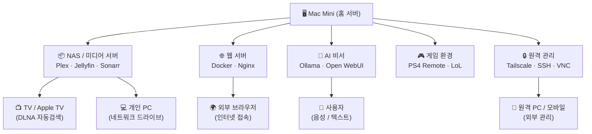

# 🖥️ Mac Mini 홈 서버 구축 계획서

> 작성일: 2026-06-07  
> 목적: Mac Mini를 활용한 개인 서버 환경 구축 로드맵

---

## 전체 아키텍처 개요



---

## 1. NAS / 미디어 서버

### 목적
- 외장 드라이브 또는 내장 저장소를 NAS처럼 활용
- TV 및 개인 PC에서 미디어 자동 검색 및 스트리밍
- 시놀로지 NAS 수준의 기능을 소프트웨어로 구현

### 미디어 폴더 구조

```
📁 미디어 저장소 (외장 HDD / NAS 마운트)
├── 📁 TV_공유/               ← TV에서 재생 (가족 공용)
│   ├── 📁 영화/
│   ├── 📁 드라마/
│   └── 📁 애니메이션/
└── 📁 개인_비공개/           ← 개인 전용 (별도 접근 권한)
    ├── 📁 영화/
    └── 📁 기타/
```

### 필요 소프트웨어 스택

| 역할 | 소프트웨어 | 설명 |
|------|-----------|------|
| 미디어 서버 | **Plex** 또는 **Jellyfin** | TV/PC 자동 검색, 스트리밍 |
| 토렌트 관리 | **qBittorrent** / **Transmission** | 자동 다운로드 |
| 자동 분류 | **Sonarr** (드라마) / **Radarr** (영화) | 메타데이터 기반 자동 정리 |
| 인덱서 | **Prowlarr** | 토렌트 인덱서 통합 관리 |
| 파일 공유 | **SMB / AFP** (macOS 내장) | PC/TV에서 네트워크 드라이브 마운트 |
| DLNA | Plex / Jellyfin 내장 | TV 자동 검색 (삼성/LG TV 호환) |

### 구현 흐름

```
토렌트 사이트
     │
     ▼
Prowlarr (인덱서 관리)
     │
     ├──▶ Sonarr (드라마 자동 관리) ──▶ qBittorrent ──▶ 📁 TV_공유/드라마/
     │
     └──▶ Radarr (영화 자동 관리)  ──▶ qBittorrent ──▶ 📁 TV_공유/영화/
                                                              │
                                                              ▼
                                                    Plex / Jellyfin
                                                    (메타데이터 자동 수집)
                                                              │
                                          ┌───────────────────┤
                                          ▼                   ▼
                                    Apple TV / TV         PC 브라우저
                                    (DLNA 자동검색)        (웹 UI)
```

### 체크리스트
- [ ] 외장 HDD 또는 내부 스토리지 확보 (최소 2TB 권장)
- [ ] Homebrew 설치
- [ ] Docker Desktop (Mac) 설치
- [ ] Plex 또는 Jellyfin 설치 및 설정
- [ ] TV_공유 / 개인_비공개 폴더 권한 분리 설정
- [ ] DLNA 활성화 및 TV 연결 테스트
- [ ] Sonarr + Radarr + Prowlarr 연동

---

## 2. 웹 서버 (Docker 기반)

### 목적
- 24시간 상시 운영 웹 서버
- Cursor에서 개발한 프로젝트를 Docker 컨테이너로 배포
- 각 서비스 독립 운영 (포트 분리)

### Docker 서비스 구성도

```
Mac Mini (24h 상시 가동)
│
└── Docker Engine
    │
    ├── 🌐 Nginx (Reverse Proxy) :80 / :443
    │       │
    │       ├──▶ 서비스 A (Todo 앱)        :3001
    │       ├──▶ 서비스 B (개인 블로그)    :3002
    │       ├──▶ 서비스 C (API 서버)       :4001
    │       └──▶ 서비스 D (기타 앱)        :3003
    │
    ├── 🗄️ PostgreSQL / MariaDB           :5432
    ├── 🔴 Redis (캐시)                   :6379
    ├── 📊 Portainer (Docker 관리 UI)     :9000
    └── 🔒 Nginx Proxy Manager           :81 (관리 UI)
```

### 배포 파이프라인

```
Cursor IDE (개발)
      │
      │ git push
      ▼
GitHub / Git 저장소
      │
      │ (수동 or 자동 훅)
      ▼
Mac Mini SSH 접속
      │
      │ docker compose pull & up -d
      ▼
서비스 재시작 (무중단 배포)
      │
      ▼
도메인 / Tailscale IP로 외부 접속
```

### 필요 소프트웨어 스택

| 역할 | 소프트웨어 | 설명 |
|------|-----------|------|
| 컨테이너 런타임 | **Docker Desktop** / **OrbStack** | Mac에서 Docker 실행 |
| 리버스 프록시 | **Nginx Proxy Manager** | 도메인 라우팅, SSL 자동화 |
| SSL 인증서 | **Let's Encrypt** (자동) | HTTPS 무료 인증서 |
| 컨테이너 관리 UI | **Portainer** | 웹 UI로 Docker 관리 |
| DB | **PostgreSQL** / **MariaDB** | 앱별 데이터베이스 |
| 모니터링 | **Uptime Kuma** | 서비스 상태 24h 모니터링 |

### 체크리스트
- [ ] Docker Desktop 또는 OrbStack 설치
- [ ] `docker-compose.yml` 기본 템플릿 작성
- [ ] Nginx Proxy Manager 설정 및 도메인 연결
- [ ] Let's Encrypt SSL 발급
- [ ] Portainer 설치
- [ ] 기존 Cursor 프로젝트 Dockerfile 작성
- [ ] GitHub Actions 또는 배포 스크립트 작성
- [ ] Uptime Kuma 모니터링 설정

---

## 3. 게임 환경

### 목적
- Mac Mini에서 PS4 원격 플레이
- League of Legends 설치 및 실행

### 설치 항목

| 게임 / 앱 | 방법 | 비고 |
|-----------|------|------|
| **PS4 Remote Play** | App Store 또는 공식 사이트 설치 | PS4와 동일 네트워크 또는 VPN |
| **League of Legends** | Riot Games 공식 Mac 클라이언트 설치 | Apple Silicon 네이티브 지원 |
| **게임 컨트롤러** | DualShock 4 Bluetooth 연결 | PS4 Remote Play용 |

### 체크리스트
- [ ] PS4 Remote Play 설치 및 PS4 계정 연결
- [ ] LoL Mac 클라이언트 다운로드 및 설치
- [ ] DualShock 4 / DualSense 컨트롤러 Bluetooth 페어링
- [ ] 게임 전용 디스플레이 해상도 설정 (옵션)

---

## 4. 원격 관리

### 목적
- 외부 어디서든 Mac Mini에 안전하게 접속
- 배포, 파일 관리, 서비스 재시작 등 원격 수행

### 원격 접속 구성도

```
외부 네트워크 (카페 / 회사 / 모바일)
           │
           │ (VPN 터널 or Tailscale)
           ▼
┌──────────────────────┐
│  Tailscale / VPN     │  ← 가장 권장 (설정 간단, 보안 강력)
└──────────┬───────────┘
           │
           ▼
      Mac Mini
      ├── SSH (터미널 접속)
      ├── VNC / macOS Screen Sharing (화면 공유)
      ├── Portainer Web UI (Docker 관리)
      └── Nginx Proxy Manager UI (서비스 관리)
```

### 필요 소프트웨어 스택

| 역할 | 소프트웨어 | 설명 |
|------|-----------|------|
| VPN / 원격 네트워크 | **Tailscale** | 설정 간단, 무료, 보안 강력 |
| SSH 접속 | macOS 내장 OpenSSH | 터미널 원격 접속 |
| 화면 공유 | macOS 내장 VNC / **RealVNC** | 데스크탑 원격 제어 |
| 파일 전송 | **SFTP** / Tailscale Drive | 파일 업로드/다운로드 |
| 웨이크온랜 | **WoL** 설정 | 전원 꺼진 Mac 원격 부팅 (옵션) |

### 체크리스트
- [ ] macOS 시스템 설정 → 공유 → **원격 로그인 (SSH)** 활성화
- [ ] macOS 시스템 설정 → 공유 → **화면 공유** 활성화
- [ ] **Tailscale** 설치 및 계정 연결
- [ ] SSH 키 인증 설정 (비밀번호 로그인 비활성화)
- [ ] Mac Mini 자동 시작 설정 (시스템 환경설정 → 에너지 절약)
- [ ] 공유기 포트포워딩 설정 (필요시)

---

## 5. AI 비서

### 목적
- Mac Mini에서 로컬 AI 모델 실행
- 쌍방 소통 가능한 개인 AI 비서 구축
- 외부 API 비용 없이 프라이버시 보호

### AI 비서 구성 옵션

```
사용자 (음성 / 텍스트 입력)
           │
           ▼
┌─────────────────────────────────┐
│  AI 비서 인터페이스              │
│  (Open WebUI / 커스텀 앱)        │
└─────────────┬───────────────────┘
              │
              ▼
┌─────────────────────────────────┐
│  로컬 LLM 엔진                  │
│  Ollama (추천) + 모델 선택       │
│  - llama3 / mistral / gemma3    │
│  - (Apple Silicon GPU 가속)     │
└─────────────┬───────────────────┘
              │
    ┌─────────┴──────────┐
    ▼                    ▼
음성 입력              텍스트 입력
(Whisper 로컬 STT)    (웹 UI / API)
    │
    ▼
음성 출력 (TTS)
(macOS say 명령어 / Coqui TTS)
```

### 필요 소프트웨어 스택

| 역할 | 소프트웨어 | 설명 |
|------|-----------|------|
| 로컬 LLM 실행 | **Ollama** | Apple Silicon 최적화, 설치 간단 |
| 웹 UI | **Open WebUI** | ChatGPT 스타일 UI (Docker) |
| 음성 인식 (STT) | **Whisper.cpp** | OpenAI Whisper 로컬 실행 |
| 음성 합성 (TTS) | macOS `say` / **Coqui TTS** | 한국어 지원 |
| 자동화 연동 | **n8n** / 직접 API 개발 | 캘린더, 알림, 파일 관리 연동 |

### 추천 모델 (Apple Silicon 기준)

| 모델 | 크기 | 특징 |
|------|------|------|
| `llama3.1:8b` | ~5GB | 빠른 응답, 일반 대화 |
| `gemma3:12b` | ~8GB | 구글 최신 모델, 한국어 양호 |
| `mistral:7b` | ~4GB | 가볍고 빠름 |
| `qwen2.5:14b` | ~9GB | 한국어 성능 우수 |

### 체크리스트
- [ ] **Ollama** 설치 (`brew install ollama`)
- [ ] 원하는 모델 다운로드 (`ollama pull llama3.1`)
- [ ] **Open WebUI** Docker 컨테이너 실행
- [ ] 음성 입력(STT) 연동 테스트
- [ ] 음성 출력(TTS) 연동 테스트
- [ ] n8n 또는 커스텀 API로 자동화 연동
- [ ] 외부 접속 가능하도록 Tailscale + Nginx 설정

---

## 전체 구축 순서 (권장 로드맵)

```
Phase 1 (기반 설정)          Phase 2 (핵심 서비스)        Phase 3 (고도화)
─────────────────            ─────────────────────        ────────────────
[ ] macOS 초기 설정          [ ] Docker + 웹서버 구축      [ ] AI 비서 구축
[ ] Homebrew 설치            [ ] Plex / Jellyfin 설치     [ ] 음성 인터페이스
[ ] Tailscale 설치           [ ] 미디어 폴더 구조 설정     [ ] 자동화 연동
[ ] SSH 원격 설정            [ ] Sonarr/Radarr 연동        [ ] 모니터링 강화
[ ] 자동 로그인 설정          [ ] 기존 앱 Docker 배포       [ ] 백업 자동화
[ ] 게임 앱 설치             [ ] 도메인 / SSL 설정
```

---

## 참고 리소스

| 항목 | 링크 |
|------|------|
| Homebrew | https://brew.sh |
| OrbStack (Docker 대안) | https://orbstack.dev |
| Ollama | https://ollama.com |
| Open WebUI | https://openwebui.com |
| Tailscale | https://tailscale.com |
| Jellyfin | https://jellyfin.org |
| Plex | https://www.plex.tv |
| Portainer | https://www.portainer.io |
| Uptime Kuma | https://github.com/louislam/uptime-kuma |

---

> 💡 **팁**: Mac Mini M 시리즈는 Apple Silicon GPU를 AI 추론에 활용할 수 있어,  
> 로컬 LLM 실행 성능이 일반 PC 대비 전력 대비 효율이 매우 높습니다.
