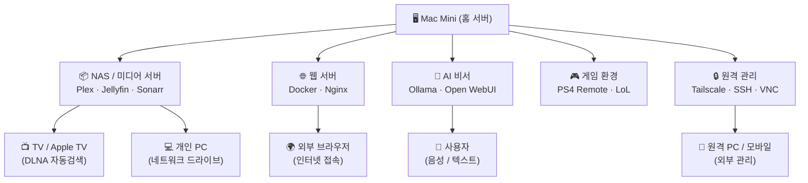

# 🖥️ Mac Mini 홈 서버 구축 계획서

> 작성일: 2026-06-07  
> 목적: Mac Mini를 활용한 개인 서버 환경 구축 로드맵

---

## 전체 아키텍처 개요




---

## 1. NAS / 미디어 서버

### 목적

- 외장 드라이브 또는 내장 저장소를 NAS처럼 활용
- TV 및 개인 PC에서 미디어 자동 검색 및 스트리밍
- 시놀로지 NAS 수준의 기능을 소프트웨어로 구현

### 미디어 폴더 구조

```
📁 미디어 저장소 (외장 HDD / NAS 마운트)
├── 📁 TV_공유/               ← TV에서 재생 (가족 공용)
│   ├── 📁 영화/
│   ├── 📁 드라마/
│   └── 📁 애니메이션/
└── 📁 개인_비공개/           ← 개인 전용 (별도 접근 권한)
    ├── 📁 영화/
    └── 📁 기타/
```

### 필요 소프트웨어 스택


| 역할     | 소프트웨어                              | 설명                     |
| ------ | ---------------------------------- | ---------------------- |
| 미디어 서버 | **Plex** 또는 **Jellyfin**           | TV/PC 자동 검색, 스트리밍      |
| 토렌트 관리 | **qBittorrent** / **Transmission** | 자동 다운로드                |
| 자동 분류  | **Sonarr** (드라마) / **Radarr** (영화) | 메타데이터 기반 자동 정리         |
| 인덱서    | **Prowlarr**                       | 토렌트 인덱서 통합 관리          |
| 파일 공유  | **SMB / AFP** (macOS 내장)           | PC/TV에서 네트워크 드라이브 마운트  |
| DLNA   | Plex / Jellyfin 내장                 | TV 자동 검색 (삼성/LG TV 호환) |


### 구현 흐름

```
토렌트 사이트
     │
     ▼
Prowlarr (인덱서 관리)
     │
     ├──▶ Sonarr (드라마 자동 관리) ──▶ qBittorrent ──▶ 📁 TV_공유/드라마/
     │
     └──▶ Radarr (영화 자동 관리)  ──▶ qBittorrent ──▶ 📁 TV_공유/영화/
                                                              │
                                                              ▼
                                                    Plex / Jellyfin
                                                    (메타데이터 자동 수집)
                                                              │
                                          ┌───────────────────┤
                                          ▼                   ▼
                                    Apple TV / TV         PC 브라우저
                                    (DLNA 자동검색)        (웹 UI)
```

### 체크리스트

- 외장 HDD 또는 내부 스토리지 확보 (최소 2TB 권장)
- Homebrew 설치
- Docker Desktop (Mac) 설치
- Plex 또는 Jellyfin 설치 및 설정
- TV_공유 / 개인_비공개 폴더 권한 분리 설정
- DLNA 활성화 및 TV 연결 테스트
- Sonarr + Radarr + Prowlarr 연동

---

## 2. 웹 서버 (Docker 기반)

### 목적

- 24시간 상시 운영 웹 서버
- Cursor에서 개발한 프로젝트를 Docker 컨테이너로 배포
- 각 서비스 독립 운영 (포트 분리)
- 공유기 포트 오픈 없이 외부에서 안전하게 접속

### 도메인 구조 (내도메인.org 기준)

> ✅ Cloudflare 계정 및 도메인 보유 완료

```
내도메인.org                  →  메인 웹사이트
www.내도메인.org              →  메인 웹사이트 (동일)
│
├── 맥미니 인프라 서비스
│   ├── nas.내도메인.org      →  Jellyfin      :8096  (미디어 스트리밍)
│   ├── ai.내도메인.org       →  Open WebUI    :3000  (AI 비서)
│   ├── monitor.내도메인.org  →  Uptime Kuma   :3100  (서비스 모니터링)
│   └── docker.내도메인.org   →  Portainer     :9000  (Docker 관리)
│
└── 앱 서비스 (앱 이름 확정 후 업데이트)
    ├── [앱1].내도메인.org    →  Docker 앱 1   :3001
    ├── [앱2].내도메인.org    →  Docker 앱 2   :3002
    └── api.내도메인.org      →  API 서버      :4001
```

### 외부 접속 전체 구조

```
외부 사용자 (브라우저 / 아이폰)
        │
        │ https://nas.내도메인.org 등
        ▼
  Cloudflare (DNS + CDN + DDoS 방어 + SSL 자동)
        │
        │ Cloudflare Tunnel (공유기 포트 오픈 불필요)
        ▼
    맥 미니 (집)
        │
        ▼
  Nginx Proxy Manager (내부 라우팅)
        │
        ├──▶ nas.내도메인.org     →  Jellyfin    :8096
        ├──▶ ai.내도메인.org      →  Open WebUI  :3000
        ├──▶ monitor.내도메인.org →  Uptime Kuma :3100
        ├──▶ docker.내도메인.org  →  Portainer   :9000
        ├──▶ [앱1].내도메인.org   →  Docker 앱1  :3001
        ├──▶ [앱2].내도메인.org   →  Docker 앱2  :3002
        └──▶ api.내도메인.org     →  API 서버    :4001
```

### Cloudflare Tunnel vs 포트포워딩


| 방식                    | 공유기 설정 | 보안       | 난이도 | 추천      |
| --------------------- | ------ | -------- | --- | ------- |
| **Cloudflare Tunnel** | 불필요    | IP 완전 숨김 | ★☆☆ | ✅ 강력 추천 |
| 포트포워딩 + DNS           | 필요     | IP 노출    | ★★☆ | △       |


### Docker 서비스 구성도

```
Mac Mini (24h 상시 가동)
│
├── cloudflared (Tunnel 데몬, 아웃바운드 연결 유지)
│
└── Docker Engine
    │
    ├── 🌐 Nginx Proxy Manager  :80 / :443 (내부 라우팅)
    │       │
    │       ├──▶ 서비스 A (Todo 앱)     :3001
    │       ├──▶ 서비스 B (개인 블로그) :3002
    │       ├──▶ 서비스 C (API 서버)    :4001
    │       └──▶ Jellyfin (미디어)      :8096
    │
    ├── 🗄️ PostgreSQL / MariaDB        :5432
    ├── 🔴 Redis (캐시)                :6379
    ├── 📊 Portainer (Docker 관리 UI)  :9000
    └── 📈 Uptime Kuma (모니터링)      :3100
```

### 로컬 개발 → 배포 전체 흐름

```
Cursor IDE (맥북 or 맥미니)
      │
      │ 로컬 테스트: localhost:3001 직접 접속
      │
      │ git push origin main
      ▼
GitHub 저장소
      │
      │ GitHub Actions 트리거
      ▼
맥미니 Self-hosted Runner
      │
      │ git pull + docker compose up -d --build
      ▼
Docker 컨테이너 재시작
      │
      ▼
Cloudflare Tunnel → 외부 자동 반영
```

### Cloudflare Tunnel 설정 방법

```bash
# 1. cloudflared 설치
brew install cloudflare/cloudflare/cloudflared

# 2. 기존 Cloudflare 계정으로 로그인 (브라우저 자동 열림)
cloudflared tunnel login

# 3. 터널 생성
cloudflared tunnel create macmini

# 4. DNS 라우팅 등록 (서비스별 반복)
cloudflared tunnel route dns macmini nas.내도메인.org
cloudflared tunnel route dns macmini ai.내도메인.org
cloudflared tunnel route dns macmini monitor.내도메인.org
cloudflared tunnel route dns macmini docker.내도메인.org
cloudflared tunnel route dns macmini api.내도메인.org

# 5. 맥미니 재부팅 후 자동 시작 등록
cloudflared service install
```

**config.yml 템플릿** (`~/.cloudflared/config.yml`)

```yaml
tunnel: <맥미니-터널-ID>
credentials-file: /Users/유저명/.cloudflared/<터널ID>.json

ingress:
  # 미디어 서버
  - hostname: nas.내도메인.org
    service: http://localhost:8096

  # AI 비서
  - hostname: ai.내도메인.org
    service: http://localhost:3000

  # 서비스 모니터링
  - hostname: monitor.내도메인.org
    service: http://localhost:3100

  # Docker 관리
  - hostname: docker.내도메인.org
    service: http://localhost:9000

  # API 서버
  - hostname: api.내도메인.org
    service: http://localhost:4001

  # 앱 서비스 (앱 이름 확정 후 추가)
  # - hostname: [앱1].내도메인.org
  #   service: http://localhost:3001
  # - hostname: [앱2].내도메인.org
  #   service: http://localhost:3002

  # 매칭 안 되는 요청 처리 (필수, 마지막에 위치)
  - service: http_status:404
```

### 필요 소프트웨어 스택


| 역할         | 소프트웨어                              | 설명                                  |
| ---------- | ---------------------------------- | ----------------------------------- |
| 컨테이너 런타임   | **OrbStack** (추천) / Docker Desktop | Mac에서 Docker 실행, OrbStack이 더 가볍고 빠름 |
| 외부 터널      | **Cloudflare Tunnel**              | 포트 오픈 없이 외부 접속, 무료                  |
| 리버스 프록시    | **Nginx Proxy Manager**            | 도메인별 내부 라우팅, 웹 UI 제공                |
| SSL 인증서    | Cloudflare 자동 처리                   | HTTPS 별도 설정 불필요                     |
| 컨테이너 관리 UI | **Portainer**                      | 웹 UI로 Docker 관리                     |
| DB         | **PostgreSQL** / **MariaDB**       | 앱별 데이터베이스                           |
| 모니터링       | **Uptime Kuma**                    | 서비스 상태 24h 모니터링                     |


### 체크리스트

- OrbStack 또는 Docker Desktop 설치
- Cloudflare 계정 보유
- 도메인(내도메인.org) 보유 및 Cloudflare DNS 관리 중
- `cloudflared` 설치 및 터널 생성 (`cloudflared tunnel create macmini`)
- Cloudflare Tunnel 서비스 자동 시작 등록
- Nginx Proxy Manager Docker 컨테이너 실행
- 서비스별 `docker-compose.yml` 작성
- 기존 Cursor 프로젝트 `Dockerfile` 작성
- Portainer 설치 및 접속 확인
- Uptime Kuma 모니터링 설정
- 외부(아이폰 등)에서 접속 테스트

---

## 3. 게임 환경

### 목적

- Mac Mini에서 PS4 원격 플레이
- League of Legends 설치 및 실행

### 설치 항목


| 게임 / 앱                | 방법                         | 비고                    |
| --------------------- | -------------------------- | --------------------- |
| **PS4 Remote Play**   | App Store 또는 공식 사이트 설치     | PS4와 동일 네트워크 또는 VPN   |
| **League of Legends** | Riot Games 공식 Mac 클라이언트 설치 | Apple Silicon 네이티브 지원 |
| **게임 컨트롤러**           | DualShock 4 Bluetooth 연결   | PS4 Remote Play용      |


### 체크리스트

- PS4 Remote Play 설치 및 PS4 계정 연결
- LoL Mac 클라이언트 다운로드 및 설치
- DualShock 4 / DualSense 컨트롤러 Bluetooth 페어링
- 게임 전용 디스플레이 해상도 설정 (옵션)

---

## 4. 원격 관리

### 목적

- 외부 어디서든 Mac Mini에 안전하게 접속
- 배포, 파일 관리, 서비스 재시작 등 원격 수행

### 원격 접속 구성도

```
외부 네트워크 (카페 / 회사 / 모바일)
           │
           │ (VPN 터널 or Tailscale)
           ▼
┌──────────────────────┐
│  Tailscale / VPN     │  ← 가장 권장 (설정 간단, 보안 강력)
└──────────┬───────────┘
           │
           ▼
      Mac Mini
      ├── SSH (터미널 접속)
      ├── VNC / macOS Screen Sharing (화면 공유)
      ├── Portainer Web UI (Docker 관리)
      └── Nginx Proxy Manager UI (서비스 관리)
```

### 필요 소프트웨어 스택


| 역할            | 소프트웨어                      | 설명                   |
| ------------- | -------------------------- | -------------------- |
| VPN / 원격 네트워크 | **Tailscale**              | 설정 간단, 무료, 보안 강력     |
| SSH 접속        | macOS 내장 OpenSSH           | 터미널 원격 접속            |
| 화면 공유         | macOS 내장 VNC / **RealVNC** | 데스크탑 원격 제어           |
| 파일 전송         | **SFTP** / Tailscale Drive | 파일 업로드/다운로드          |
| 웨이크온랜         | **WoL** 설정                 | 전원 꺼진 Mac 원격 부팅 (옵션) |


### 체크리스트

- macOS 시스템 설정 → 공유 → **원격 로그인 (SSH)** 활성화
- macOS 시스템 설정 → 공유 → **화면 공유** 활성화
- **Tailscale** 설치 및 계정 연결
- SSH 키 인증 설정 (비밀번호 로그인 비활성화)
- Mac Mini 자동 시작 설정 (시스템 환경설정 → 에너지 절약)
- 공유기 포트포워딩 설정 (필요시)

---

## 5. AI 비서

### 목적

- Mac Mini에서 로컬 AI 모델 실행
- 쌍방 소통 가능한 개인 AI 비서 구축
- 외부 API 비용 없이 프라이버시 보호

### AI 비서 구성 옵션

```
사용자 (음성 / 텍스트 입력)
           │
           ▼
┌─────────────────────────────────┐
│  AI 비서 인터페이스              │
│  (Open WebUI / 커스텀 앱)        │
└─────────────┬───────────────────┘
              │
              ▼
┌─────────────────────────────────┐
│  로컬 LLM 엔진                  │
│  Ollama (추천) + 모델 선택       │
│  - llama3 / mistral / gemma3    │
│  - (Apple Silicon GPU 가속)     │
└─────────────┬───────────────────┘
              │
    ┌─────────┴──────────┐
    ▼                    ▼
음성 입력              텍스트 입력
(Whisper 로컬 STT)    (웹 UI / API)
    │
    ▼
음성 출력 (TTS)
(macOS say 명령어 / Coqui TTS)
```

### 필요 소프트웨어 스택


| 역할          | 소프트웨어                       | 설명                       |
| ----------- | --------------------------- | ------------------------ |
| 로컬 LLM 실행   | **Ollama**                  | Apple Silicon 최적화, 설치 간단 |
| 웹 UI        | **Open WebUI**              | ChatGPT 스타일 UI (Docker)  |
| 음성 인식 (STT) | **Whisper.cpp**             | OpenAI Whisper 로컬 실행     |
| 음성 합성 (TTS) | macOS `say` / **Coqui TTS** | 한국어 지원                   |
| 자동화 연동      | **n8n** / 직접 API 개발         | 캘린더, 알림, 파일 관리 연동        |


### 추천 모델 (Apple Silicon 기준)


| 모델            | 크기   | 특징               |
| ------------- | ---- | ---------------- |
| `llama3.1:8b` | ~5GB | 빠른 응답, 일반 대화     |
| `gemma3:12b`  | ~8GB | 구글 최신 모델, 한국어 양호 |
| `mistral:7b`  | ~4GB | 가볍고 빠름           |
| `qwen2.5:14b` | ~9GB | 한국어 성능 우수        |


### 체크리스트

- **Ollama** 설치 (`brew install ollama`)
- 원하는 모델 다운로드 (`ollama pull llama3.1`)
- **Open WebUI** Docker 컨테이너 실행
- 음성 입력(STT) 연동 테스트
- 음성 출력(TTS) 연동 테스트
- n8n 또는 커스텀 API로 자동화 연동
- 외부 접속 가능하도록 Tailscale + Nginx 설정

---

## 6. CI/CD 자동 배포 파이프라인

### 목적

- Cursor에서 코딩 후 `git push` 한 번으로 오라클 서버 + 맥미니 Docker 동시 자동 배포
- 각 서버가 GitHub에서 직접 코드를 당겨가는 Self-hosted Runner 방식

### 전체 배포 흐름

```
Cursor IDE (맥북 or 맥미니)
        │
        │ git push origin main
        ▼
    GitHub 저장소
        │
        │ GitHub Actions 트리거
        │
        ├─────────────────────────────────────┐
        ▼                                     ▼
  오라클 서버                            맥 미니 (집)
  Self-hosted Runner                   Self-hosted Runner
  (서버가 직접 당겨감)                   (서버가 직접 당겨감)
        │                                     │
        ▼                                     ▼
  git pull + 재시작                   git pull + docker compose up -d
```

> 외부에서 서버로 접속할 필요 없음 — 각 서버가 GitHub Actions를 구독하며 알아서 실행

---

### Self-hosted Runner 구성 전략

저장소가 여러 개(개인 계정)인 경우 → **맥미니에 Runner 여러 개를 폴더 분리하여 설치**

```
맥 미니 (macOS 호스트)
│
├── ~/actions-runner-app1/   ← 저장소 A 전용 Runner
├── ~/actions-runner-app2/   ← 저장소 B 전용 Runner
├── ~/actions-runner-app3/   ← 저장소 C 전용 Runner
│
└── Docker (OrbStack)
    ├── 컨테이너 A  ← Runner A가 배포
    ├── 컨테이너 B  ← Runner B가 배포
    └── 컨테이너 C  ← Runner C가 배포
```

> Runner는 맥미니 macOS에 직접 설치 (Docker 컨테이너 안에 설치 X)  
> 각 Runner가 해당 저장소의 push 이벤트만 구독하여 독립 동작

---

### Runner 설치 방법 (저장소별 반복)

```bash
# 저장소마다 아래 과정을 반복 (폴더 이름만 다르게)

# ── 저장소 A ──
mkdir ~/actions-runner-app1 && cd ~/actions-runner-app1
curl -o actions-runner-osx-arm64.tar.gz -L https://github.com/actions/runner/releases/latest/download/actions-runner-osx-arm64.tar.gz
tar xzf ./actions-runner-osx-arm64.tar.gz
# GitHub 저장소 A → Settings → Actions → Runners → New runner → 토큰 발급
./config.sh --url https://github.com/유저명/저장소A --token 발급된토큰A --name runner-app1 --labels app1,macmini
./svc.sh install && ./svc.sh start

# ── 저장소 B ──
mkdir ~/actions-runner-app2 && cd ~/actions-runner-app2
# ... 동일 과정, 토큰만 저장소 B 것으로 교체
./config.sh --url https://github.com/유저명/저장소B --token 발급된토큰B --name runner-app2 --labels app2,macmini
./svc.sh install && ./svc.sh start

# ── 저장소 C ──
mkdir ~/actions-runner-app3 && cd ~/actions-runner-app3
./config.sh --url https://github.com/유저명/저장소C --token 발급된토큰C --name runner-app3 --labels app3,macmini
./svc.sh install && ./svc.sh start
```

---

### 각 저장소의 deploy.yml

저장소마다 `.github/workflows/deploy.yml` 을 작성, `runs-on` 라벨만 다르게

```yaml
# 저장소 A의 deploy.yml
name: Deploy

on:
  push:
    branches: [main]

jobs:
  deploy-oracle:
    runs-on: [self-hosted, oracle]      # 오라클 서버 Runner
    steps:
      - uses: actions/checkout@v4
      - run: |
          cd /app/app1
          git pull origin main
          docker compose up -d --build

  deploy-macmini:
    runs-on: [self-hosted, app1]        # 맥미니 app1 Runner
    steps:
      - uses: actions/checkout@v4
      - run: |
          cd ~/app/app1
          git pull origin main
          docker compose up -d --build
```

> 저장소 B, C도 동일 구조, `runs-on` 라벨(`app2`, `app3`)만 변경

---

### Runner 상태 확인

```bash
# 실행 중인 Runner 서비스 확인
~/actions-runner-app1/svc.sh status
~/actions-runner-app2/svc.sh status
~/actions-runner-app3/svc.sh status

# GitHub에서도 확인
# 각 저장소 → Settings → Actions → Runners → 녹색 표시 확인
```

---

### 배포 시나리오 예시

```
상황: 맥북 프로에서 저장소 A 기능 추가 후 커밋

$ git push origin main  (저장소 A)

         ↓ 자동으로 동시 진행

오라클 서버 (Runner: oracle)    맥미니 (Runner: app1)
──────────────────────          ──────────────────────
git pull                        git pull
docker compose up -d            docker compose up -d
✅ 배포 완료                     ✅ 배포 완료

저장소 B, C는 영향 없음 → 각자 독립 동작
```

---

### 체크리스트

- [ ] 저장소별 Runner 폴더 생성 (`~/actions-runner-app1`, `app2`, `app3` ...)
- [ ] 각 저장소에서 Runner 토큰 발급 (Settings → Actions → Runners)
- [ ] 저장소별 Runner 설치 및 라벨 지정
- [ ] 모든 Runner `./svc.sh install` 로 자동 시작 등록
- [ ] 각 저장소에 `.github/workflows/deploy.yml` 작성
- [ ] 오라클 서버 Runner 등록 (라벨: `oracle`) — 기존 방식 유지
- [ ] 테스트 커밋으로 저장소별 독립 배포 확인
- [ ] GitHub Actions 탭에서 Runner 녹색 상태 확인

---

## 전체 구축 순서 (권장 로드맵)

```
Phase 1 (기반 설정)          Phase 2 (핵심 서비스)        Phase 3 (고도화)
─────────────────            ─────────────────────        ────────────────
[ ] macOS 초기 설정          [ ] Docker + 웹서버 구축      [ ] AI 비서 구축
[ ] Homebrew 설치            [ ] Plex / Jellyfin 설치     [ ] 음성 인터페이스
[ ] Tailscale 설치           [ ] 미디어 폴더 구조 설정     [ ] 자동화 연동
[ ] SSH 원격 설정            [ ] Sonarr/Radarr 연동        [ ] 모니터링 강화
[ ] 자동 로그인 설정          [ ] 기존 앱 Docker 배포       [ ] 백업 자동화
[ ] 게임 앱 설치             [ ] 도메인 / SSL 설정
[ ] Self-hosted Runner 등록  [ ] CI/CD 배포 파이프라인 구성
```

---

## 참고 리소스


| 항목                   | 링크                                                                                 |
| -------------------- | ---------------------------------------------------------------------------------- |
| Homebrew             | [https://brew.sh](https://brew.sh)                                                 |
| OrbStack (Docker 대안) | [https://orbstack.dev](https://orbstack.dev)                                       |
| Ollama               | [https://ollama.com](https://ollama.com)                                           |
| Open WebUI           | [https://openwebui.com](https://openwebui.com)                                     |
| Tailscale            | [https://tailscale.com](https://tailscale.com)                                     |
| Jellyfin             | [https://jellyfin.org](https://jellyfin.org)                                       |
| Plex                 | [https://www.plex.tv](https://www.plex.tv)                                         |
| Portainer            | [https://www.portainer.io](https://www.portainer.io)                               |
| Uptime Kuma          | [https://github.com/louislam/uptime-kuma](https://github.com/louislam/uptime-kuma) |


---

> 💡 **팁**: Mac Mini M 시리즈는 Apple Silicon GPU를 AI 추론에 활용할 수 있어,  
> 로컬 LLM 실행 성능이 일반 PC 대비 전력 대비 효율이 매우 높습니다.

